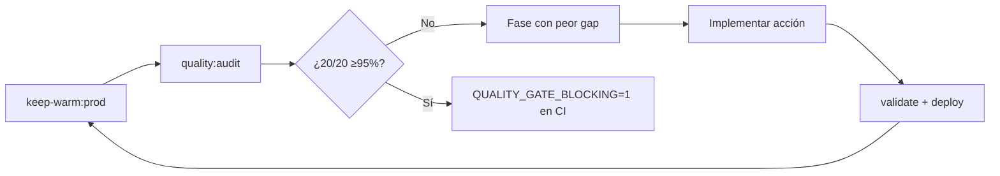

# Auditoría de calidad web — meta ≥95% en 20 rankings

Metodología unificada para medir, puntuar y subir la nota de **queveohoy.es** de forma iterativa.

## Comando principal

```bash
npm run keep-warm:prod && npm run quality:audit
```

Salida:

- `docs/quality-reports/quality-scorecard-latest.json`
- `docs/quality-reports/quality-scorecard-latest.md`

Variables:

| Variable | Efecto |
|----------|--------|
| `QUALITY_URL` | URL auditada (default `https://queveohoy.es`) |
| `QUALITY_SKIP_LH=1` | Reutiliza último JSON Lighthouse local |
| `QUALITY_SKIP_WARM=1` | Sin pre-calentamiento |
| `QUALITY_GATE_BLOCKING=1` | Exit 1 si algún ranking <95% |

## Los 20 rankings

| # | Ranking | Método de medición | Meta |
|---|---------|-------------------|------|
| 1 | Lighthouse Performance | LH mobile post warm-up | ≥95 |
| 2 | Lighthouse Accessibility | LH categoría a11y | ≥95 |
| 3 | Lighthouse Best Practices | LH categoría BP | ≥95 |
| 4 | Lighthouse SEO | LH categoría SEO | ≥95 |
| 5 | LCP | LH lab · escala good≤2.5s / poor≥4s | ≥95 |
| 6 | INP | LH lab · max-potential-fid (proxy) | ≥95 |
| 7 | CLS | LH lab · good≤0.05 | ≥95 |
| 8 | TBT | LH lab · good≤200ms | ≥95 |
| 9 | FCP | LH lab · good≤1.8s | ≥95 |
| 10 | Speed Index | LH lab · good≤3.4s | ≥95 |
| 11 | TTFB | fetch home · good≤600ms | ≥95 |
| 12 | Security headers | probe HSTS/CSP/XFO/XCTO | ≥95 |
| 13 | Production smoke | verify-prod pass rate | ≥95 |
| 14 | API contract | health + feed-meta + ETag 304 | ≥95 |
| 15 | SEO infrastructure | JSON-LD + canonical + OG | ≥95 |
| 16 | A11y automation | proxy LH a11y + E2E | ≥95 |
| 17 | Dependency security | npm audit high/critical | ≥95 |
| 18 | E2E quality | Playwright (manual/CI) | ≥95 |
| 19 | CDN / cache | Cache-Control + ETag APIs | ≥95 |
| 20 | PWA readiness | manifest + SW + LH installable | ≥95 |

## Baseline producción (2026-06-11, post warm-up)

Medición local contra `https://queveohoy.es`:

| Ranking | Score | Estado |
|---------|------:|--------|
| LH Performance | **91** | 🟡 |
| LH Accessibility | **100** | ✅ |
| LH Best Practices | **100** | ✅ |
| LH SEO | **100** | ✅ |
| LCP | **~70** (2.95s) | 🔴 |
| INP (proxy) | **~100** (123ms) | ✅ |
| CLS | **100** | ✅ |
| TBT | **100** (73ms) | ✅ |
| FCP | **100** | ✅ |
| PWA readiness | **~75** | 🟡 |

**Sin warm-up**, Performance cae a ~55 (cold start Vercel + TBT alto). Siempre auditar tras `keep-warm:prod`.

## Plan por fases (hasta ≥95% global)

### Fase 1 — Ya verde (mantener)

- A11y LH 100, BP 100, SEO 100, CLS, verify-prod 22/22
- Acción: ampliar axe a `/explorar`, `/partido/[slug]`, `/cuenta/login`

### Fase 2 — Performance & LCP (prioridad)

Objetivo: Performance **91→95+**, LCP **2.95s→≤2.5s**

1. **Keep-warm obligatorio pre-audit y post-deploy** (`keep-warm:prod` cada min en Vercel cron)
2. **LCP poster**: confirmar WebP local en hero UFC/Champions; preload en `HomeLcpPreload`
3. **HomeFeed**: diferir hidratación (`interaction-gate`, `shouldDeferHeavyClient`)
4. **TTFB**: ISR en `/api/v2/feed` con `s-maxage`; edge cache feed-meta
5. **Gate CI**: `PERF_GATE_BLOCKING=1` con LCP ≤2500 tras warm

Comprobar: `npm run perf:budget` con `PERF_BUDGET_LCP_MS=2500`

### Fase 3 — Seguridad & dependencias

1. Endurecer CSP (`script-src` sin `'unsafe-inline'` donde sea posible)
2. `npm audit fix` + Trivy blocking en CI
3. Probe headers en `verify:prod` (curl HSTS/CSP)

### Fase 4 — PWA & RUM

1. Manifest: `display_override`, shortcuts, theme_color audit
2. SW: offline shell mínimo para installability LH (opcional si producto es web-first)
3. `@vercel/speed-insights` + CrUX field data en dashboard
4. `web-vitals` RUM con consent

### Fase 5 — E2E blocking & matriz URLs

1. Playwright en CI **blocking** (quitar `continue-on-error` en deploy)
2. LHCI ampliado: `/`, `/explorar`, `/guia/champions-espana`, `/partido/*`, mobile+desktop
3. Añadir INP assert en `lighthouserc.json`

## Ciclo de mejora continua



Semanalmente:

1. `npm run quality:audit`
2. Revisar `quality-scorecard-latest.md`
3. Atacar rankings con `gap` mayor en la fase activa
4. Repetir hasta media ≥95% y 20/20 pass

## Integración CI (recomendado)

```yaml
# Tras deploy producción
- run: npm run keep-warm:prod
- run: npm run quality:audit
  env:
    QUALITY_GATE_BLOCKING: "1"
```

## Herramientas complementarias

| Comando | Uso |
|---------|-----|
| `npm run perf:audit` | Multi-motor (TTFB, k6, Newman, PSI) |
| `npm run perf:budget` | Gate LCP/CLS/perf rápido |
| `npm run lhci` | LH CI local 3 URLs |
| `npm run verify:prod` | Smoke funcional prod |
| `npm run test:e2e` | Playwright smoke + axe |

## Definición de éxito

**Objetivo cumplido** cuando `quality:audit` reporta:

- `summary.passing === summary.measured === 20`
- `summary.average ≥ 95`
- Mediciones con warm-up (condiciones realistas de usuario recurrente)
